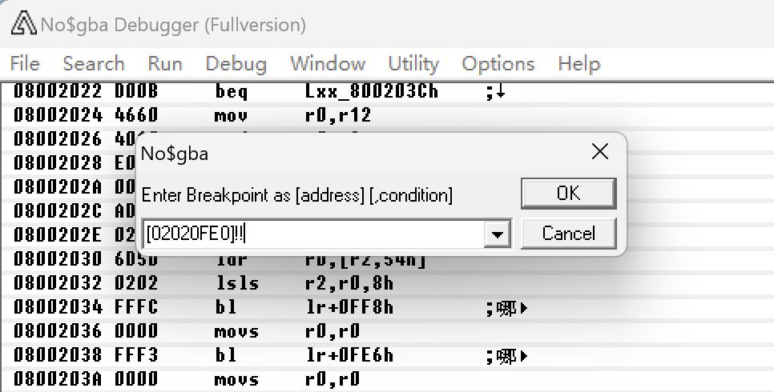

### 工具下载/点位开源

[ChisBread/ChisFlashGBARumbleCollect](https://github.com/ChisBread/ChisFlashGBARumbleCollect)

### 原理篇

#### 震动补丁原理

当GBA程序执行到ROM地址A(也就是触发某个"事件"时)，跳转到震动补丁**b**所在的地址B，B会**先执行A原本的指令，然后触发震动，触发完成后返回A地址**继续执行后续指令

也就是说，我们需要通过各种方法，来寻找合适的地址**A**，并且生成正确的补丁程序**b**，将b放到合适的空白区域，也就是地址B，最后将地址A处的命令替换为跳转到地址B即可

标绿的部分，是RumblePatch.exe自动完成的

#### 补丁地址A的寻找方法

##### 金手指辅助法

金手指的基本原理：锁定某个数据地址（接下来叫DA）上的数据值，以达成作弊。比如锁定生命值。

震动逻辑和金手指关注的逻辑紧密相关，比如血量、比如经验值。我们期望掉血/回血时震动，实际上就需要找到哪段ROM地址A，修改了锁血金手指DA的数据

那么如何通过DA找到A？------
使用NO\$GBA的条件断点（触发某个DA变化，则程序暂停在A处）就可以立刻找到A！

**也就是说，有了金手指，就有了震动！**

###### 附：

**两种不同的断点**

1.  变化断点（即数据发生变化就暂停到A）

\[金手指地址\]!!

e.g. \[02020FE1\]!!

2.  相等断点 （即数据变为某个值）

> \[02020FE1\]==0

**EC金手指转R4金手指地址**

地址加上0x02000000即可，后面的数据我们不关心

##### 瞪眼法

和金手指辅助法不一样，瞪眼法需要逐帧对比游戏画面和DA的变化，比如星之卡比在力竭的时候，某个数据位会变成7A（可以录屏，观察画面和数据位的变化）\...那么通过条件断点就可以找到力竭的地址A

##### 动态调试法

没基础的就算了

#### 补丁地址A需要上下挪动的情况

如果遇到上下1个地址有cmp、或者bx,bl,ldr pc，应该避开

### 实操篇

#### 星之卡比------镜之大迷宫

##### NO\$GBA功能概览（本篇用到的功能）

我们需要根据**数据区**的变换，来找**代码区**的地址

{width="4.5in"
height="2.509922353455818in"}

选择 Debug-\>Define Break/Condition 打条件断点

{width="3.3333333333333335in"
height="2.397820428696413in"}

##### 

##### 掉血震动点位（金手指辅助法）

利用到的金手指: 体力 02020FE0:0F

打个条件断点

\[02020FE0\]!!

即体力发生变化，则暂停

{width="4.600297462817148in"
height="2.3334842519685037in"}

找个怪碰一下，触发条件

{width="4.59375in"
height="2.7379615048118984in"}

地址0x084A920

{width="4.677083333333333in"
height="1.1658825459317586in"}

由于下一个语句是cmp（见**补丁地址A需要上下挪动的情况**）

我们网上挪一个，挪到0x084A91E

至此完成掉血震动点位的寻找

##### 

##### 

##### 回血震动点位（金手指辅助法）

同上，金手指也是02020FE0:0F

打断点\[02020FE0\]!!

找个回血的吃一口

找到0x08123012

##### 变身震动点位（金手指辅助法）

变身金手指：正常=02020FE3:00喷火=02020FE3:01冷冻=02020FE3:02回力镖=02020FE3:06火焰冲撞=02020FE3:03

我们发现地址都是02020FE3，如法炮制

打断点\[02020FE3\]!!

找到 0x0805C178

##### 击杀震动点位（瞪眼法）

游戏和人物的状态（力竭、濒死、无敌、跑步、吸气）和统计（生命值、电量、进度等）一般都集中在相同数据区域，比如星之卡比就在02020FE0附近，重点关注

{width="5.0732239720034995in"
height="3.636152668416448in"}

录屏发现，怪物被击杀时02020FCC会发生变化，直接下断点

\[02020FCC\]!!

找到 0x08099B64

##### 力竭震动点位（瞪眼法）

也是录屏，吸气直到力竭，观察到

{width="5.768055555555556in"
height="3.1643886701662294in"}

{width="5.0in"
height="3.3333333333333335in"}

02020FB4会变成7A，**这次我们不能使用之前的断点，我们需要下个相等断点**

打断点 \[02020FB4\]==7A，吸气直到力竭

找到 0x08054ADA

##### 

##### 

##### 

##### 使用RumblePatch.exe生成震动ROM

最后我们找到了

掉血 0x0804A91E

回血 0x08123012

变身 0x0805C178

吐出 0x08054F60

力竭 0x08054ADA

击杀 0x08099B64

拖动原ROM到补丁工具，输入地址，最后输入q

输出_rumble.gba

至此，震动ROM制作完成

{width="3.3229166666666665in"
height="1.5345614610673666in"}

{width="5.017930883639545in"
height="4.026639326334208in"}

##### 使用DeRumblePatch.exe 反向提取点位

同理，拖动震动ROM到程序上

### 

### 异常处理篇

如果遇到卡死、闪退，说明可能补丁地址不合法，尝试上下挪动

### 正确的震动ROM分享姿势

合理的分享方式为点位+注释优先

可以附带成品ROM
